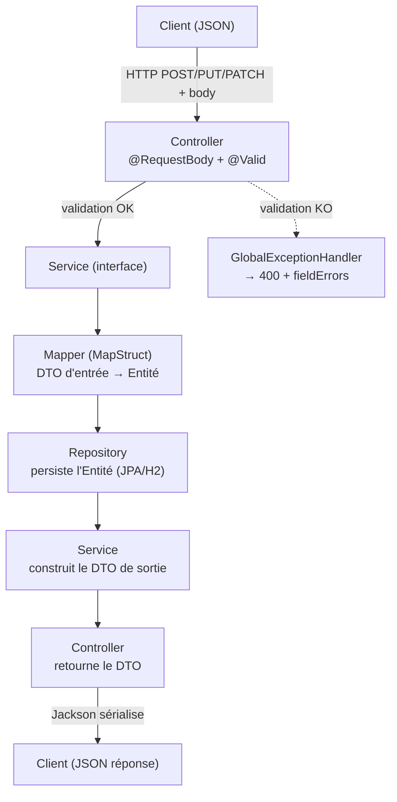

# Les DTOs — contrats d'échange de l'API

## 1. Pourquoi des DTOs ?

Un **DTO** (*Data Transfer Object*) est un objet dédié aux **échanges avec l'extérieur**.
La règle d'or du projet : **aucune entité JPA (`@Entity`) n'est jamais exposée par l'API.**

Avantages :
- **Découplage** : on peut faire évoluer le modèle de base (entité) sans casser l'API, et inversement.
- **Sécurité** : le client ne peut pas écrire des champs internes (`id`, `deleted`, `createdAt`…).
- **Clarté du contrat** : chaque opération a son DTO avec ses propres règles de validation.
- **Enrichissement** : un DTO de réponse peut combiner plusieurs sources (ex. un suivi + le titre de l'anime).

Tous les DTOs sont des `record` Java **immuables** et `public` (seule partie publique d'un domaine avec l'interface de service).

---

## 2. Catalogue des DTOs

### Domaine Catalogue (`fr.miage.numres.catalog`)

| DTO | Sens | Utilisé par | Champs |
|-----|------|-------------|--------|
| `AnimeCreateDTO` | entrée | `POST` **et** `PUT` | `title`*, `synopsis`, `studio`, `episodes`, `genres` |
| `AnimePatchDTO` | entrée | `PATCH` | tous **optionnels** |
| `AnimeDTO` | sortie | toutes les réponses | `id`, `title`, `synopsis`, `studio`, `episodes`, `genres`, `deleted` |

### Domaine Watchlist (`fr.miage.numres.watchlist`)

| DTO | Sens | Utilisé par | Champs |
|-----|------|-------------|--------|
| `WatchlistEntryCreateDTO` | entrée | `POST` | `userId`, `animeId`*, `status`, `currentEpisode`, `score` |
| `WatchlistEntryReplaceDTO` | entrée | `PUT` | `status`*, `currentEpisode`*, `score` |
| `WatchlistEntryPatchDTO` | entrée | `PATCH` | tous **optionnels** |
| `WatchlistEntryDTO` | sortie | toutes les réponses | `id`, `userId`, `username`, `animeId`, `animeTitle`, `animeAvailable`, `status`, `currentEpisode`, `totalEpisodes`, `score`, `createdAt`, `updatedAt` |

*(\* = champ obligatoire)*

> Remarque : il existe **un DTO d'entrée par intention** (créer / remplacer / modifier
> partiellement) car les règles de validation diffèrent (voir [`EXCEPTIONS.md` §5](EXCEPTIONS.md)).
> En revanche **un seul DTO de sortie** par domaine suffit.

---

## 3. Workflow d'une requête (entrée → traitement → sortie)



### Étapes détaillées

**Sens entrant (le client écrit) :**
1. Le client envoie du **JSON**.
2. Spring le désérialise (Jackson) en **DTO d'entrée** (`...CreateDTO` / `...ReplaceDTO` / `...PatchDTO`).
3. `@Valid` déclenche la **validation Bean Validation**. Si elle échoue → `400` + `fieldErrors` (le service n'est jamais appelé).
4. Le **contrôleur** passe le DTO au **service** (il ne fait que ça : pas de logique métier).
5. Le **mapper MapStruct** convertit le DTO en **entité** (ou applique les champs sur une entité existante pour PUT/PATCH).
6. Le **service** applique les règles métier, puis le **repository** persiste l'**entité**.

**Sens sortant (le client lit) :**
7. Le **service** reconstruit un **DTO de sortie** (`AnimeDTO` / `WatchlistEntryDTO`) à partir de l'entité — éventuellement enrichi de données d'autres domaines.
8. Le **contrôleur** retourne ce DTO ; Jackson le sérialise en **JSON**.

➡️ **L'entité JPA reste confinée entre le mapper et le repository. Elle ne franchit jamais la frontière HTTP.**

---

## 4. Cas particulier : le DTO de sortie de la Watchlist (enrichissement)

Contrairement au Catalogue (mapping direct entité→DTO via MapStruct), le `WatchlistEntryDTO`
n'est **pas** produit par le mapper : il est **assemblé à la main dans le service**, car il
combine **trois sources** :

```
WatchlistEntry (entité locale)  +  AnimeDTO (via AnimeService)  +  User (username)
        │                                  │                          │
        ├── id, status, currentEpisode,    ├── animeTitle             └── username
        │   score, createdAt, updatedAt    ├── totalEpisodes
        └── userId, animeId                └── animeAvailable
```

Voir `WatchlistServiceImpl.toDTO(...)`. C'est ce qui permet d'afficher le titre de l'anime
dans la watchlist **sans** créer de dépendance vers l'entité du Catalogue (on passe par
l'interface `AnimeService` — la référence reste souple).

---

## 5. Champs obligatoires — récapitulatif rapide

| Opération | DTO | Obligatoire | Optionnel |
|-----------|-----|-------------|-----------|
| `POST /api/catalog` | `AnimeCreateDTO` | `title` | `synopsis`, `studio`, `episodes`, `genres` |
| `PUT /api/catalog/{id}` | `AnimeCreateDTO` | `title` | les autres (remplacés, `null` si omis) |
| `PATCH /api/catalog/{id}` | `AnimePatchDTO` | *(aucun)* | tous |
| `POST /api/watchlist` | `WatchlistEntryCreateDTO` | `animeId` | `userId` (défaut `demo`), `status` (défaut `PLAN_TO_WATCH`), `currentEpisode` (défaut `0`), `score` |
| `PUT /api/watchlist/{id}` | `WatchlistEntryReplaceDTO` | `status`, `currentEpisode` | `score` |
| `PATCH /api/watchlist/{id}` | `WatchlistEntryPatchDTO` | *(aucun)* | tous |

> **Non, en POST tous les champs ne sont pas obligatoires.** Seuls les champs réellement
> indispensables le sont : `title` (catalogue) et `animeId` (watchlist). Le reste a des
> valeurs par défaut ou est facultatif. Détails et différence **PUT vs PATCH** dans
> [`EXCEPTIONS.md`](EXCEPTIONS.md).
