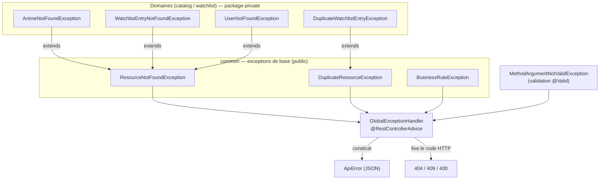

# Gestion des erreurs — exceptions, codes & messages

## 1. Vue d'ensemble : qui parle à qui ?

La gestion d'erreurs repose sur **4 briques** réparties entre le noyau `common` et les domaines :



| Brique | Rôle | Visibilité |
|--------|------|-----------|
| **Exceptions de base** (`common`) | définissent une **famille** d'erreur (introuvable, doublon, règle métier) | `public` |
| **Exceptions de domaine** | cas concrets avec un **message précis** | `package-private` |
| **`GlobalExceptionHandler`** | **traduit** chaque famille en code HTTP + corps normalisé | `public` |
| **`ApiError`** | **format JSON** uniforme de toute réponse d'erreur | `public` |

---

## 2. La connexion entre les composants

### a) Héritage : du concret vers le générique
Chaque domaine définit ses propres exceptions, mais elles **étendent** une exception de base :

```10:15:src/main/java/fr/miage/numres/catalog/AnimeNotFoundException.java
class AnimeNotFoundException extends ResourceNotFoundException {

    AnimeNotFoundException(Long id) {
        super("Aucun anime trouvé pour l'identifiant " + id);
    }
}
```

- `AnimeNotFoundException`, `WatchlistEntryNotFoundException`, `UserNotFoundException` → `ResourceNotFoundException` (404)
- `DuplicateWatchlistEntryException` → `DuplicateResourceException` (409)
- `BusinessRuleException` est levée directement par le service (400)

**Pourquoi ?** Le handler n'a pas besoin de connaître chaque exception de domaine : il
intercepte le **type de base**. On peut donc ajouter de nouvelles exceptions de domaine
sans jamais toucher au handler → c'est le **O de SOLID** (ouvert à l'extension, fermé à la modification).

### b) Interception centralisée : le `GlobalExceptionHandler`
Un seul point traduit les exceptions en réponses HTTP, pour **les deux domaines** :

```25:47:src/main/java/fr/miage/numres/common/GlobalExceptionHandler.java
    @ExceptionHandler(ResourceNotFoundException.class)
    public ResponseEntity<ApiError> handleNotFound(ResourceNotFoundException ex, HttpServletRequest request) {
        return build(HttpStatus.NOT_FOUND, ex.getMessage(), request, Map.of());
    }

    @ExceptionHandler(DuplicateResourceException.class)
    public ResponseEntity<ApiError> handleDuplicate(DuplicateResourceException ex, HttpServletRequest request) {
        return build(HttpStatus.CONFLICT, ex.getMessage(), request, Map.of());
    }

    @ExceptionHandler(BusinessRuleException.class)
    public ResponseEntity<ApiError> handleBusinessRule(BusinessRuleException ex, HttpServletRequest request) {
        return build(HttpStatus.BAD_REQUEST, ex.getMessage(), request, Map.of());
    }

    @ExceptionHandler(MethodArgumentNotValidException.class)
    public ResponseEntity<ApiError> handleValidation(MethodArgumentNotValidException ex, HttpServletRequest request) {
        Map<String, String> fieldErrors = new HashMap<>();
        for (FieldError error : ex.getBindingResult().getFieldErrors()) {
            fieldErrors.put(error.getField(), error.getDefaultMessage());
        }
        return build(HttpStatus.BAD_REQUEST, "La validation de la requête a échoué", request, fieldErrors);
    }
```

Conséquence : **les contrôleurs ne contiennent aucun `try/catch`**. Ils lèvent (via le
service) des exceptions métier, et le handler s'occupe du reste.

---

## 3. Comment sont gérés les codes et les messages

| Type d'erreur | Exception levée | Code HTTP | Message |
|---------------|-----------------|-----------|---------|
| Ressource introuvable | `*NotFoundException` → `ResourceNotFoundException` | **404** | message précis de l'exception (ex. « Aucun anime trouvé pour l'identifiant 99 ») |
| Doublon | `DuplicateWatchlistEntryException` → `DuplicateResourceException` | **409** | « L'anime X est déjà présent dans la watchlist de l'utilisateur Y » |
| Règle métier violée | `BusinessRuleException` | **400** | ex. « La progression (30) dépasse le nombre d'épisodes de l'anime (25) » |
| Validation des champs | `MethodArgumentNotValidException` (auto, via `@Valid`) | **400** | « La validation de la requête a échoué » + map `fieldErrors` champ→raison |

- **Le code HTTP** est décidé par le handler (`HttpStatus.NOT_FOUND`, etc.), jamais codé en dur dans le contrôleur.
- **Le message** vient de l'exception elle-même (construite dans le domaine), ce qui le rend précis et localisé en français.

### Le format de réponse : `ApiError`
Toute erreur renvoie **le même JSON** :

```json
{
  "timestamp": "2026-06-11T09:10:00Z",
  "status": 404,
  "error": "Not Found",
  "message": "Aucun anime trouvé pour l'identifiant 99",
  "path": "/api/catalog/99",
  "fieldErrors": {}
}
```

Pour une erreur de validation, `fieldErrors` est rempli :

```json
{
  "status": 400,
  "error": "Bad Request",
  "message": "La validation de la requête a échoué",
  "path": "/api/catalog",
  "fieldErrors": { "title": "Le titre est obligatoire", "episodes": "Le nombre d'épisodes ne peut pas être négatif" }
}
```

---

## 4. A-t-on bien évité les erreurs 500 ?

**Oui, pour tous les cas pilotés par le client.** Chaque mauvaise entrée possible produit un
code **4xx** explicite, jamais un `500` :

- id inexistant → `404` (pas une `NullPointerException` non gérée) ;
- doublon → `409` (intercepté avant l'insertion, pas une violation de contrainte SQL brute) ;
- progression invalide → `400` (règle métier) ;
- champ manquant/invalide → `400` (validation).

Le contrat « pas de 500 pour une faute du client » est donc respecté, et c'est **testé**
(voir `CatalogIntegrationTest`, `WatchlistIntegrationTest`, et les tests de contrôleurs).

> **Transparence (un cas où le 500 est légitime).** Si `userId` est omis **et** que
> l'utilisateur de démonstration `demo` est absent de la base, le service lève une
> `IllegalStateException` non interceptée → `500`. Ce cas ne dépend **pas** du client mais
> d'une **mauvaise configuration serveur** (le seed `demo` est toujours créé au démarrage).
> Un `500` y est donc sémantiquement **correct** : c'est bien une erreur du serveur, pas de
> l'appelant.
>
> Durcissement possible (non requis par l'énoncé) : ajouter un
> `@ExceptionHandler(Exception.class)` de dernier recours qui renvoie un `500` au format
> `ApiError` sans divulguer la stacktrace.

---

## 5. Gestion des champs en POST / PUT / PATCH

C'est un point clé du respect des conventions REST. Les trois verbes ont des **DTO et des
règles différents** — ce n'est pas un hasard.

### POST — création (champs obligatoires ≠ « tous »)
Seuls les champs **réellement indispensables** sont obligatoires :

- `POST /api/catalog` (`AnimeCreateDTO`) → **`title` obligatoire** (`@NotBlank`). Le reste est facultatif.
- `POST /api/watchlist` (`WatchlistEntryCreateDTO`) → **`animeId` obligatoire** (`@NotNull`).
  `userId`, `status`, `currentEpisode`, `score` sont optionnels (valeurs par défaut posées par le service :
  `demo`, `PLAN_TO_WATCH`, `0`).

➡️ **Non, en POST tous les champs ne sont pas obligatoires.**

### PUT — remplacement **complet** (sémantique « tout ou rien »)
Le PUT remplace l'**intégralité de l'état modifiable**. Les champs structurants restent
protégés par le mapper.

- `PUT /api/catalog/{id}` réutilise `AnimeCreateDTO` : `title` obligatoire ; **les champs
  omis sont écrasés à `null`** (c'est le sens d'un remplacement complet). Le mapper ignore
  `id` et `deleted` (on ne « ressuscite » pas un anime via un PUT).

```24:27:src/main/java/fr/miage/numres/catalog/AnimeMapper.java
    //Remplacement complet (PUT) : tous les champs sont écrasés, sauf l'identifiant et le flag deleted
    @Mapping(target = "id", ignore = true)
    @Mapping(target = "deleted", ignore = true)
    void updateEntityFromDto(AnimeCreateDTO dto, @MappingTarget Anime entity);
```

- `PUT /api/watchlist/{id}` (`WatchlistEntryReplaceDTO`) : **`status` et `currentEpisode`
  obligatoires**, `score` optionnel (`null` = effacé). Le mapper **ignore `userId` et
  `animeId`** : un PUT ne permet pas de changer le propriétaire ni l'anime ciblé.

### PATCH — mise à jour **partielle** (seuls les champs fournis)
Tous les champs du DTO de PATCH sont optionnels, et **seuls les non-nuls sont appliqués**,
grâce à la stratégie MapStruct `NullValuePropertyMappingStrategy.IGNORE` :

```31:38:src/main/java/fr/miage/numres/watchlist/WatchlistMapper.java
    // Mise à jour partielle (PATCH) : les champs nuls du DTO ne sont pas appliqués
    @BeanMapping(nullValuePropertyMappingStrategy = NullValuePropertyMappingStrategy.IGNORE)
    @Mapping(target = "id", ignore = true)
    @Mapping(target = "userId", ignore = true)
    @Mapping(target = "animeId", ignore = true)
    @Mapping(target = "createdAt", ignore = true)
    @Mapping(target = "updatedAt", ignore = true)
    void patchEntityFromDto(WatchlistEntryPatchDTO patchDTO, @MappingTarget WatchlistEntry entry);
```

C'est exactement ce qui permet de n'envoyer que `{"currentEpisode": 12}` sans toucher au
statut ni au score.

### Récapitulatif PUT vs PATCH

| | PUT (remplacement) | PATCH (partiel) |
|--|--------------------|-----------------|
| Champs envoyés | **tout l'état** | **seulement ceux à changer** |
| Champ omis | écrasé (`null` / valeur par défaut) | **inchangé** |
| Champs obligatoires | oui (cf. DTO) | aucun |
| Stratégie mapper | écrase tout | ignore les `null` |
| Champs jamais modifiables | `id`, `deleted` / `userId`, `animeId`, timestamps | idem |

> ✅ La distinction PUT (idempotent, complet) / PATCH (partiel) est donc **correctement
> implémentée**, à la fois par des DTO distincts et par deux stratégies de mapping distinctes.
